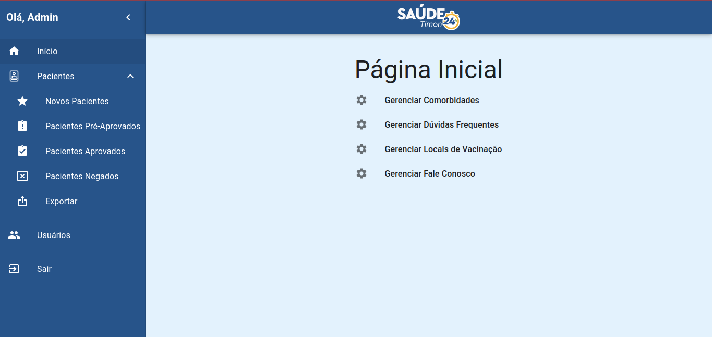
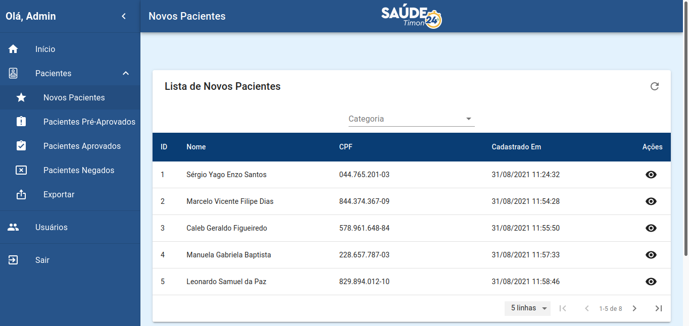
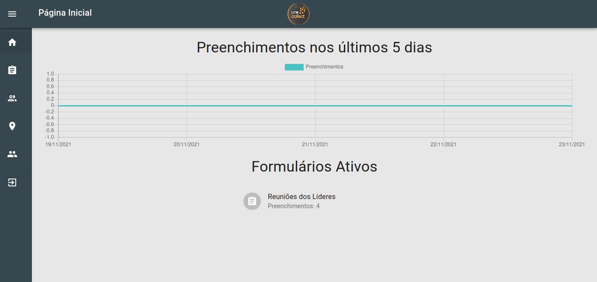
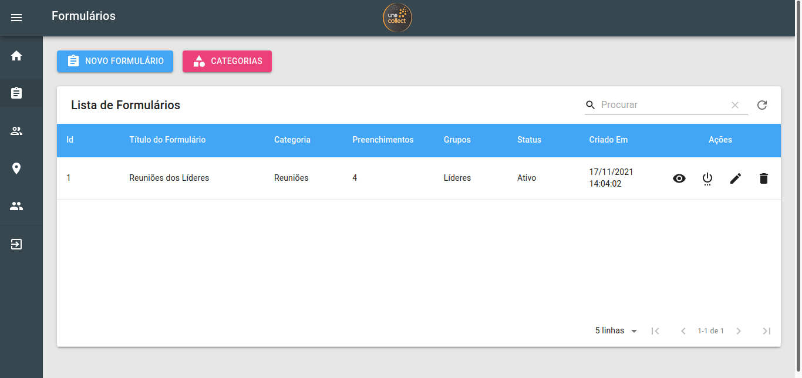
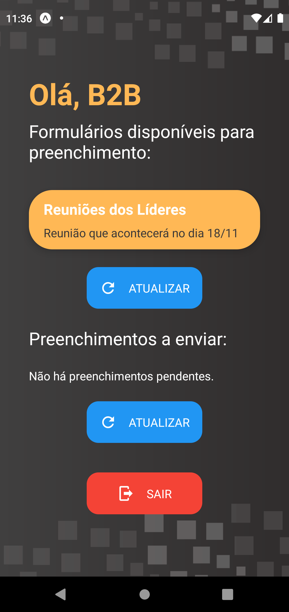
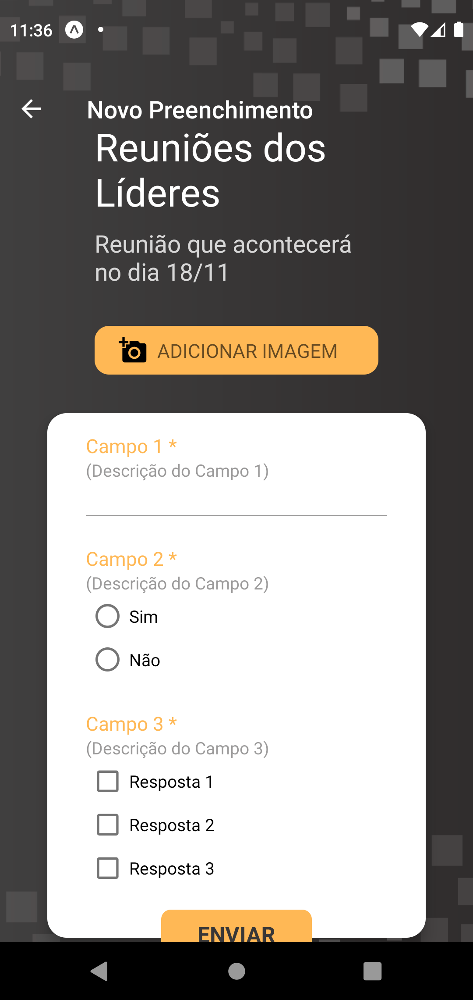
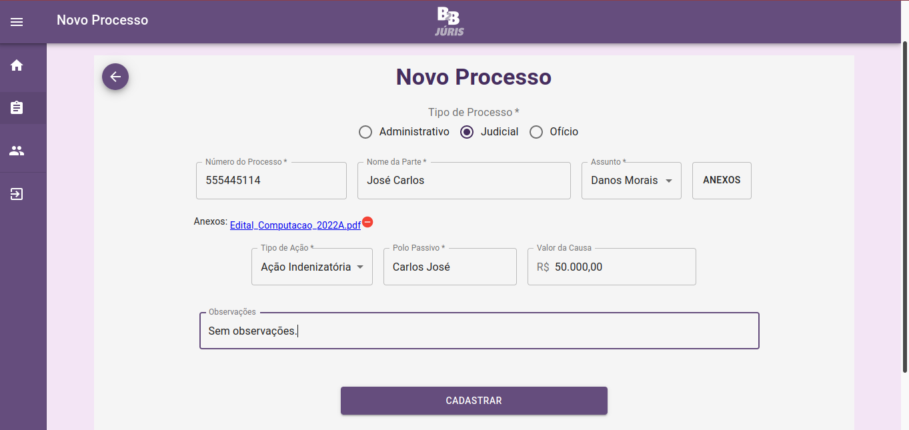
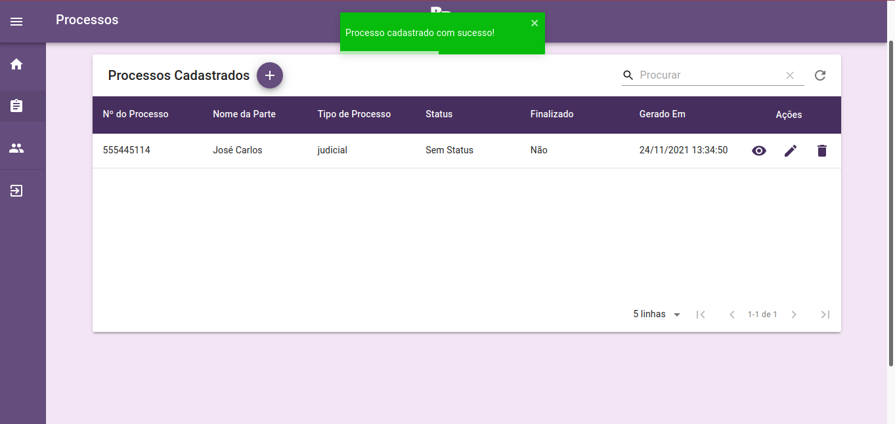

# Olá! Me chamo Renan Cunha! 👋 🇧🇷
## Bem vindo ao meu perfil do Github!

### Sou de Teresina (PI) e sou bacharel em Ciência da Computação pela faculdade Estácio de Teresina possuindo também uma pós graduação em Engenharia de Software a concluir pela mesma faculdade.

## Ferramentas e Tecnologias
* Atualmente trabalho com a stack FullJS, tendo conhecimentos em tecnologias como:

  
  
  
  
  (Native)
  
  
  
  
  

* Possuo também conhecimentos intermediários na linguagem PHP, já tendo feito alguns projetos com wordpress e laravel.
* Possuo conhecimentos em banco de dados relacionais, dentre eles PostgreSQL e MySQL. Possuo conhecimentos intermediários em MongoDB.
* Possuo também conhecimentos intermediários em Linux, já tendo configurado servidores do zero para o ambiente de produção.
* Busco estar sempre em constante evolução e aprendendo mais sobre o mundo do desenvolvimento. Tenho como focos atuais aprender sobre padrões de projeto mais avançados como SOLID, Dependency Injection, entre outros que possam vir a ser úteis para uma boa escrita de código.

  

## Principais Projetos
### Saúde Timon 24h
O aplicativo Saúde Timon 24h permite aos usuários realizar o cadastro para a vacinação contra a Covid-19 na cidade de Timon-MA.

Dentre as funcionalidades estão o cadastro para a vacinação por grupos, checagem do status do cadastro, consulta  a locais de vacinação, entre outros.

O projeto foi feito de forma desacoplada utilizando uma API Rest com o Express no backend e tecnologias como React, React Native e Next no frontend.

* [Backend](https://github.com/renanfvcunha/saudetimon-backend)
* [Frontend](https://github.com/renanfvcunha/saudetimon-frontend)
* [Mobile](https://github.com/renanfvcunha/saudetimon-mobile)
* [Client](https://github.com/renanfvcunha/saudetimon-client)

Demonstração:
* Frontend:

* Mobile: https://play.google.com/store/apps/details?id=com.accesssollutions.saudetimon24h
* Client: https://www.saudetimon24h.com.br/

### Uno Collect
O aplicativo Uno Collect permite o cadastro de formulários personalizados e a inserção de respostas por usuários cadastrados.

O projeto foi feito de forma desacoplada utilizando uma API Rest com o Express no backend e tecnologias como React e React Native no frontend.

* [Backend](https://github.com/renanfvcunha/unocollect-backend)
* [Frontend](https://github.com/renanfvcunha/unocollect-frontend)
* [Mobile](https://github.com/renanfvcunha/unocollect-mobile)

Demonstração
* Frontend:

* Mobile:

### B2B Juris
O sistema web B2B Juris foi desenvolvido com a finalidade de auxiliar na movimentação de processos jurídicos de uma procuradoria na cidade de Timon-MA.

O projeto foi feito de forma desacoplada utilizando uma API Rest com o Express no backend e React no frontend.

* [Backend](https://github.com/renanfvcunha/b2bjuris-backend)
* [Frontend](https://github.com/renanfvcunha/b2bjuris-frontend)

Demonstração:

## Contatos

  
  
  
  

